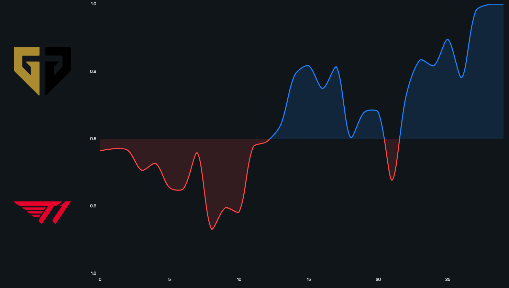

# LoL Win Probabilities

LoL Win Probabilities is a project inspired by the work of the LoL Esports team in partnership with AWS on Win Probability for Worlds 2023 (article [here](https://lolesports.com/article/dev-diary-win-probability-powered-by-aws-at-worlds/blt403ee07f98e2e0fc))

## What is LoL Win Probabilities

LoL Win Probabilities uses Machine Learning to estimate a team's probability to win the game at any time of the game. The win probability is calculated by comparing the current game state with historical games in similar situations taking a large amount of metrics such as the game time and the gold difference into account.

It helps to better understand the anatomy of a given game and it gives insights on the value and efficiency of different strategies and objectives during the game.

## How does LoL Win Probabilities work

LoL Win Probabilities is based on a Machine Learning algorithm named XGBoost that is pre-trained on a large dataset of S14 Challenger SoloQ games from EUW, KR and NA servers.

The model takes into account a large set of features that represent the state of the game with as much details as possible.

* Game time
* Gold% (for each player)
* XP% (for each player)
* \# of players alive on each team
* \# of turrets taken (each type of turret is counted separately)
* Time before inhibitor respawn
* Herald
* \# of Void Grubs
* \# of Dragons (each elemental dragon counted separately)
* Dragon Soul
* Elder buff timer (for each player)
* \# of players with Elder buff
* Nashor buff timer (for each player)
* \# of players with Nashor buff

## Win Probability vs Gold Difference

The current go-to metric to estimate which team is more likely to win a game is the gold difference. The win probability takes more elements of the game into account (XP, dragons, void grubs...) and provides a more accurate and readable way to follow the state of a game. The win probability is more intuitive and doesn't need additional game knowledge to be understood whereas gold difference often needs more context. A win probability of 40% has always the same meaning during the game whereas a +2k gold difference has a different impact depending on the game time.

## Further Work

Further improvements can be made to the win probability model by better representing the state of the game. For example a good addition would be a team composition feature which would take champions scaling, team synergies and counters into account. Another axis to explore is to evaluate the impact of individual plays or decisions throughout the game to help players and teams to take the decision that would give them the best edge on the opponent.